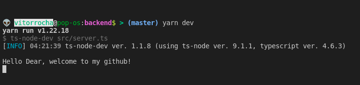

   

---

## What's up? [Click here to know more about me ;)](https://vitorrrocha.github.io)

### :rocket: Technologies and Skills

  <code></code>
  <code></code>
  <code></code>
  <code></code> 
  <code></code>
  <code>Teamwork</code>
  <code>Empathy</code>
  

   

